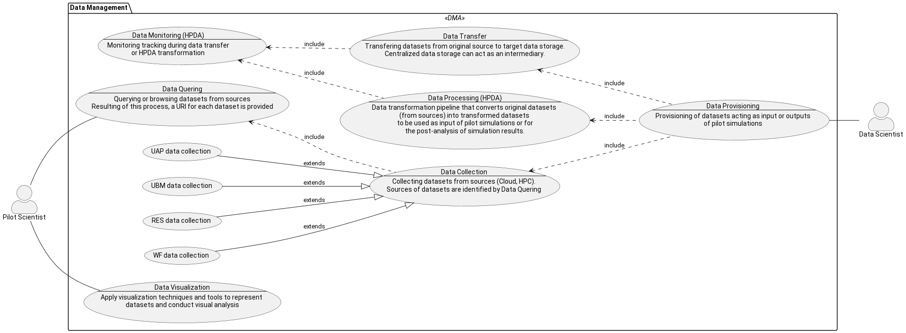

# T4.3-AI

This repository contains UML diagrams describing HiDALGO2 use cases/scenarios

## References
- [UML Diagrams](https://www.uml-diagrams.org/)(1)
- [PlantUML](https://plantuml.com/)

## UML Notation
From (1), 
- **Use Case Diagrams**:
"Use case diagrams are usually referred to as behavior diagrams used to describe a set of actions (use cases) that some system or systems (subject) should or can perform in collaboration with one or more external users of the system (actors). Each use case should provide some observable and valuable result to the actors or other stakeholders of the system."

- **Use Case**: "A use case is a kind of behaviored classifier that specifies a [complete] unit of [useful] functionality performed by [one or more] subjects to which the use case applies in collaboration with one or more actors, and which [for complete use cases] yields an observable result that is of some value to those actors [or other stakeholders] of each subject".

- **Actor**: An actor is behaviored classifier which specifies a role played by an external entity that interacts with the subject (e.g., by exchanging signals and data), a human user of the designed system, some other system or hardware using services of the subject. 

For those not familiarized with UML, this is a brief summary of notation for UC diagrams, using below UC diagram as an example

- Actor: represented as a human figure icon,
- Use case: represented as an oval figure,
- **Association** (connects an use case with the actor that performs it): represented as a continuous line connecting an actor to a use case, 
- **Generalization** (child use case inherits properties and behavior of the parent use case and may override the behavior of the parent): represented as a solid directed line with a large hollow triangle arrowhead, connecting two use cases,
- **Extension** (specifies how and when the behavior defined in usually supplementary (optional) extending use case can be inserted into the behavior defined in the extended use case): represented as dashed directed line with a open triangle arrowhead, connecting two use cases.

